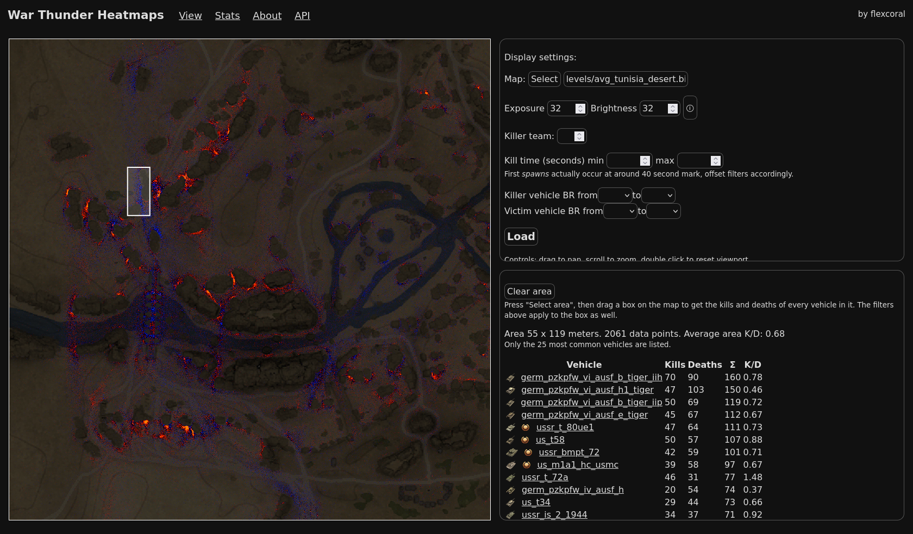
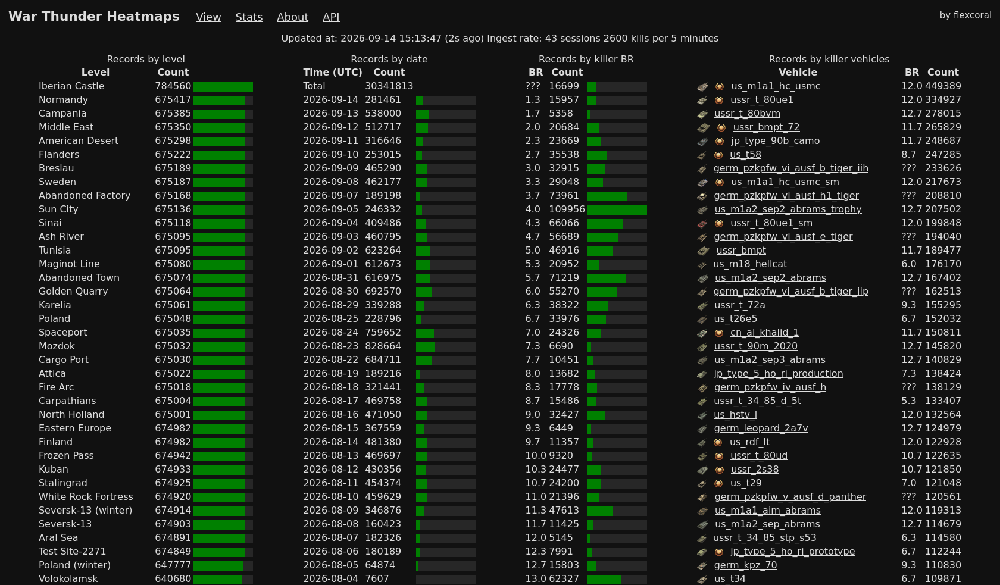

# WT-Heatmaps

So I wanted to find the most absurd positions and map them...

Turns out it is not that hard if you think about it.

ATM hosted at: https://thunder.nanachi.party/

## Supporting infrastructure

Couple deps:

- Working postgres cluster
- Downloading, parsing and carving (currently offloaded to Lux infrastructure
at https://wtapi.dev/ but can be done via my wrpl-inspector)

## Screenshots

## Contribution

Feel free to reach out if you need something specific, open an issue or
contact me via Discord.

Pull requests are welcome, but please discuss them first before putting in
the effort. AI powered contributions would have to meet strict requirements.
